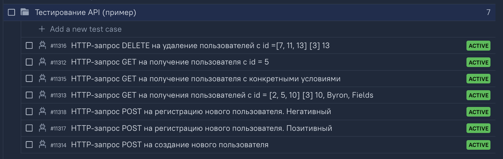
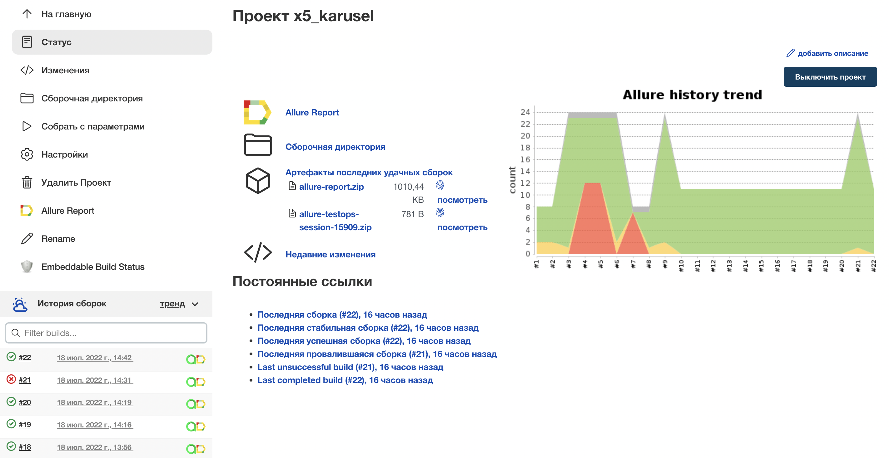
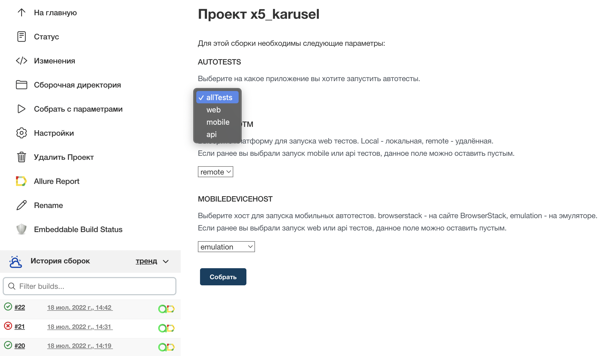
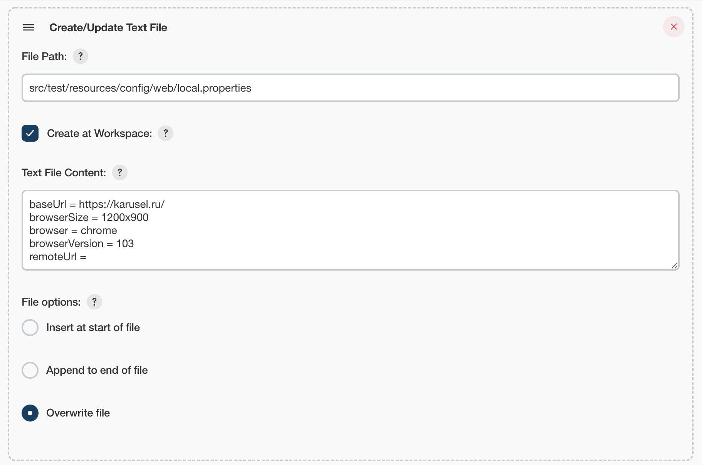
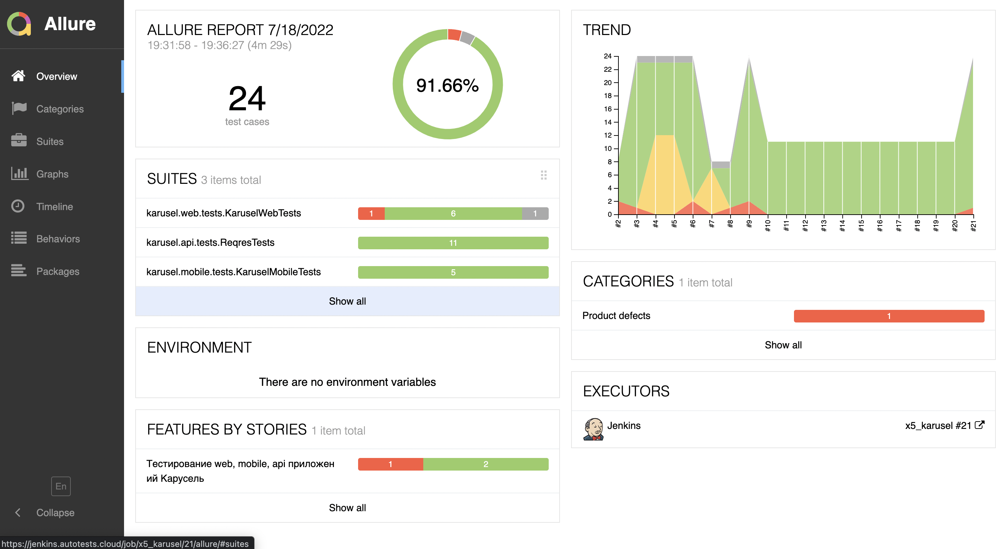
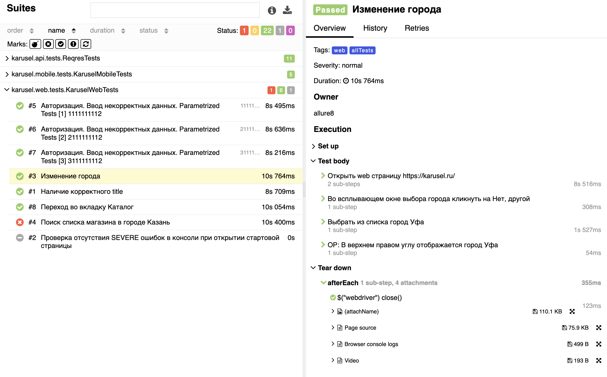
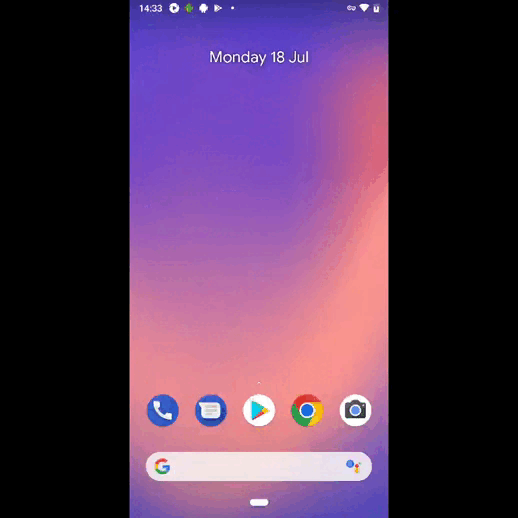
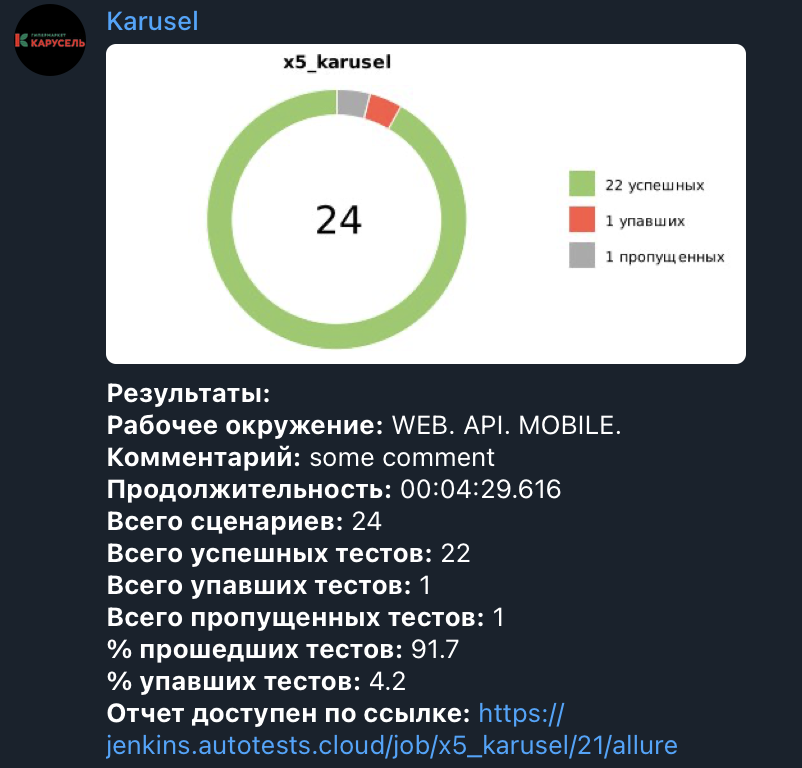

# Проект по тестированию WEB, Mobile и API платформ [Гипермаркета КАРУСЕЛЬ](https://karusel.ru/)

## Содержание:

* [Технологии, используемые в данном проекте](https://github.com/SvetlanaVaskevich/qa_guru_diplom#%D1%82%D0%B5%D1%85%D0%BD%D0%BE%D0%BB%D0%BE%D0%B3%D0%B8%D0%B8-%D0%B8%D1%81%D0%BF%D0%BE%D0%BB%D1%8C%D0%B7%D1%83%D0%B5%D0%BC%D1%8B%D0%B5-%D0%B2-%D0%B4%D0%B0%D0%BD%D0%BD%D0%BE%D0%BC-%D0%BF%D1%80%D0%BE%D0%B5%D0%BA%D1%82%D0%B5)
* [Тест кейсы](https://github.com/SvetlanaVaskevich/qa_guru_diplom#%D1%82%D0%B5%D1%81%D1%82-%D0%BA%D0%B5%D0%B9%D1%81%D1%8B)
* [Сборка в Jenkins](https://github.com/SvetlanaVaskevich/qa_guru_diplom#%D1%81%D0%B1%D0%BE%D1%80%D0%BA%D0%B0-%D0%B2-jenkins)
* [Информация о тестах в Allure report]()
* [Интеграция с AllureTestOps]()

## Технологии, используемые в данном проекте

В данном проекте сценарии автотестов написаны в **AllureTestOps**.

Сами автотесты написаны на **Java** с использованием фреймворка для тестирования **Selenide**. Для сборки проекта в среде **IntelliJ IDEA** используется **Gradle**. **JUnit5** задействован в качестве фреймворка модульного тестирования. Запуск тестов выполняется из **Jenkins**. **Selenoid** используется для запуска браузеров в контейнерах **Docker**.

**Browserstack** используется для запуска мобильных тестов. Для запуска на эмуляторе используются **Android Studio** и **Appium**. 

Отчеты по результатам прогона автотестов формируются в **Allure Report**, **AllureTestOps**.

Так же настроена отправка уведомленний в **Telegram**.

## Тест кейсы

### Тест кейсы для WEB тестирования

### Тест кейсы для MOBILE тестирования

### Тест кейсы для API тестирования

## [Сборка в Jenkins](https://jenkins.autotests.cloud/job/x5_karusel/)

Перед началом запуска сборки мы можем выбрать следующие параметры:

_AUTOTESTS_ - выбрать автоесты на какую платформу мы хотим запустить.

_WEBPLATFOTM_ - платформу для запуска WEB автотестов.

_MOBILEDEVICEHOST_ - платформу для запуска MOBILE автотестов.

### Так же можно настраивать параметры запуска автотестов в .properties файлах
Пример local.properties

## Отчеты по тестированию в [Allure report](https://jenkins.autotests.cloud/job/x5_karusel/21/allure/)

### Главное окно

### Окно с тестовыми кейсами
В данном окне мы можем подробно изучить результаты прогона автотеста. Посмотреть тестовые данные, шаги автотеста, проверки.

Так же во вкладке _Tear down_ изучить скриншоты последней страницы, браузерную консоль и видео запись прохождения автотеста.

### Пример видео записи мобильного автотеста №11221 по переходу во вкладку Акции.

## Интеграция с [AllureTestOps](https://allure.autotests.cloud/project/1252/test-cases?treeId=0)

## Уведомление в Telegram

После завершения тестов отчет о прохождении приходит в Telegram-чат

Пример отчета

